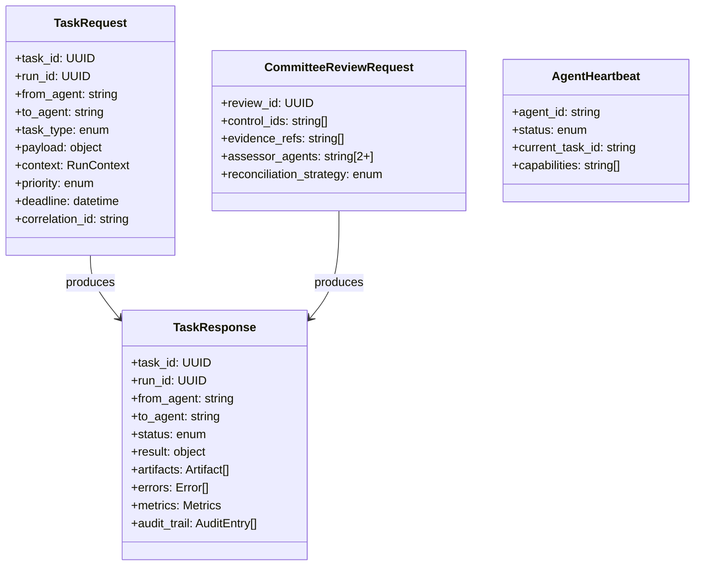
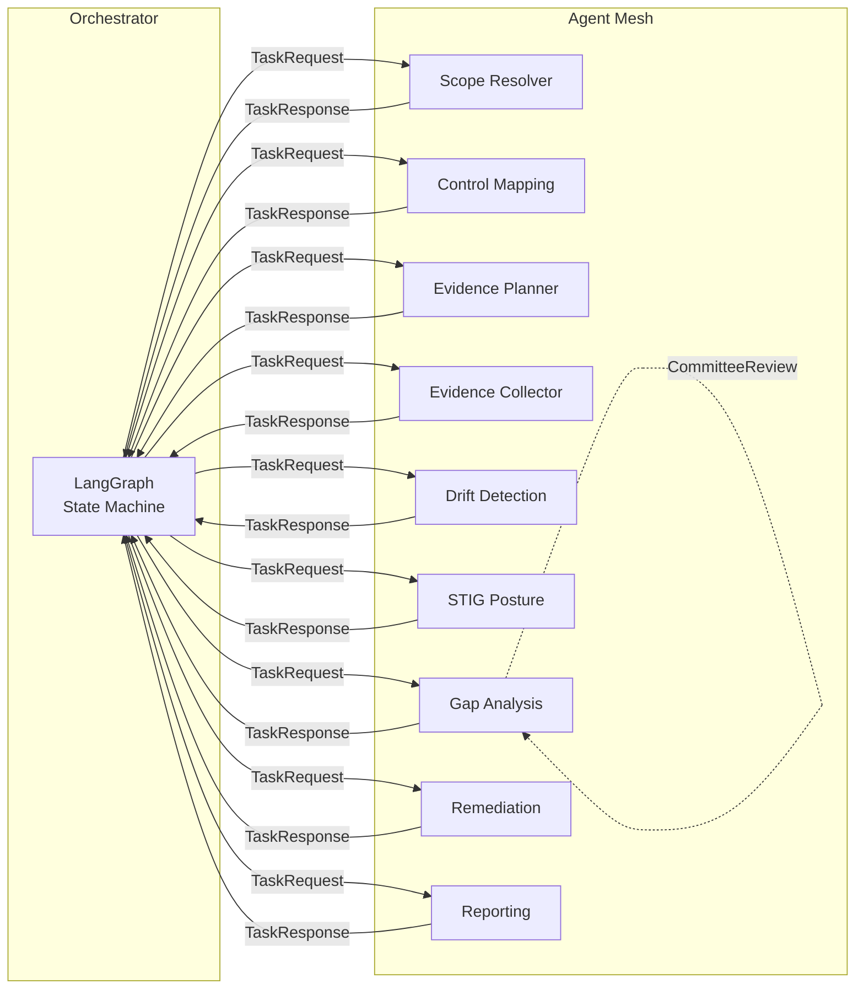

# A2A Protocol — Agent-to-Agent Communication

## Overview

Agents in the compliance mesh communicate via structured A2A messages. Each agent can be independently deployed as a service, enabling horizontal scaling and specialized resource allocation.

## Message Types

## Agent Registry

| Agent ID | Type | Capabilities |
|----------|------|-------------|
| `scope_resolver` | Utility | Scope resolution, RBAC enforcement |
| `control_mapping_agent` | RAG | Control mapping, framework crosswalk |
| `evidence_planner_agent` | Agentic RAG | Evidence planning, tool selection, freshness evaluation |
| `evidence_collector_agent` | MCP | Evidence collection, artifact storage |
| `drift_detection_agent` | MCP | Drift detection, change attribution, baseline comparison |
| `stig_posture_agent` | MCP | STIG assessment, SCAP scanning, CKL ingestion |
| `gap_analysis_agent` | Advanced RAG | Gap analysis, contradiction detection, sufficiency scoring |
| `remediation_agent` | MCP | POA&M creation, ticket creation, PR creation |
| `reporting_agent` | RAG | Report generation, SSP delta, ConMon summary |

## Communication Flow

## Task Types

- `control_mapping` — Map controls from frameworks to system boundary
- `evidence_planning` — Plan evidence collection strategy
- `evidence_collection` — Collect evidence via MCP tools
- `drift_detection` — Detect config drift across providers
- `stig_assessment` — STIG/SCAP assessment and mapping
- `gap_analysis` — Advanced gap analysis with sufficiency scoring
- `remediation` — Create POA&M, tickets, PRs
- `reporting` — Generate compliance reports
- `committee_review` — Dual-agent independent assessment for high-risk controls

## Schema File

See `schemas/a2a/agent_messages.json` for full JSON Schema definitions.
