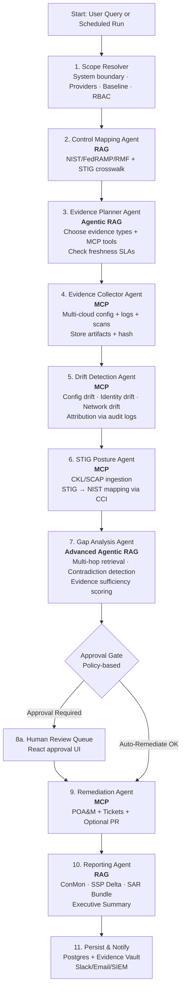
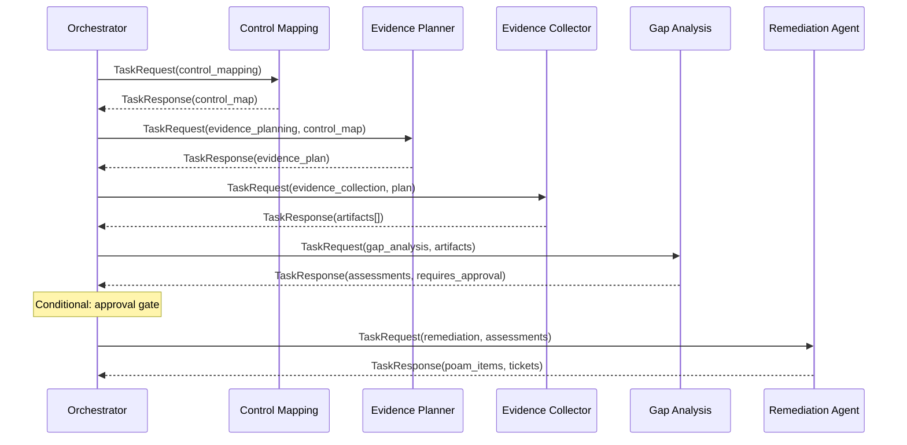
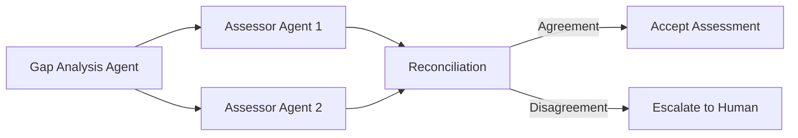

# Agent Workflow — LangGraph Compliance Pipeline

## Workflow Diagram

## RAG Tiers

| Tier | Agent | What It Does |
|------|-------|-------------|
| **RAG** | Control Mapping, Reporting | Retrieves compliance knowledge (controls, STIGs, SSP, policies) for context-aware responses |
| **Agentic RAG** | Evidence Planner | Iteratively decides which evidence to collect, checks freshness, selects MCP tools |
| **Advanced Agentic RAG** | Gap Analysis | Multi-hop retrieval, cross-encoder reranking, contradiction detection, evidence sufficiency scoring |

## Agent Communication (A2A)

## Committee Review (High-Risk Controls)

For high-risk controls, two agents independently assess and reconcile:

## Approval Gate Rules

| Condition | Action |
|-----------|--------|
| Any control fails with `severity: critical/high` | Route to human approval |
| CAT I STIG finding open | Route to human approval |
| Critical drift detected | Route to human approval |
| All assessments pass or low/moderate severity | Auto-remediate (create POA&M + tickets) |
