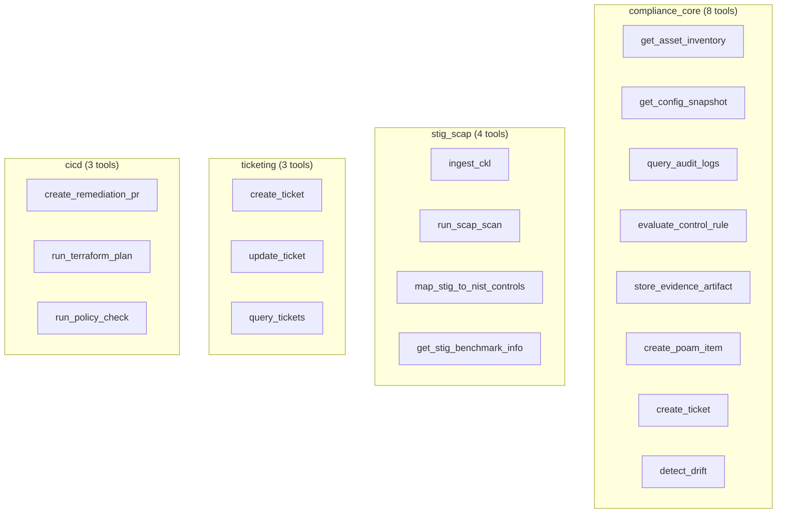
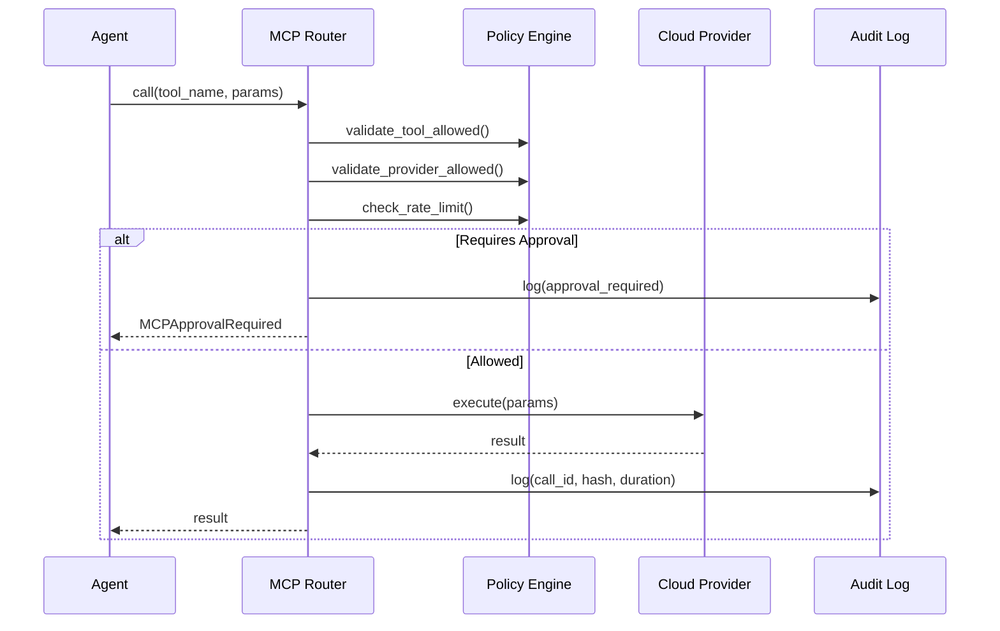

# MCP Tool Schemas — Multi-Cloud Compliance

## Design Principles

1. **One canonical interface, multiple provider implementations** — Same tool contract across AWS/Azure/GCP
2. **`provider` field routes to the right implementation** — Gov variants differ in endpoints, not operations
3. **Every tool returns**: `provider`, `system_id`, `evidence_artifact_id`, `hash`, `timestamp`
4. **MCP Router enforces**: allowlisted APIs, least-privilege credentials, rate limits, approval gates
5. **Full audit trail**: Every tool call is logged with input/output hash for compliance

## Tool Organization

## Provider Mapping

| Canonical Operation | AWS | Azure | GCP |
|-------------------|-----|-------|-----|
| Asset Inventory | AWS Config | Resource Graph | Cloud Asset Inventory |
| Config Snapshot | Config + IAM + EC2/S3/EKS | ARM + Policy + Resource Graph | Asset Inventory (RESOURCE) |
| Audit Logs | CloudTrail | Activity Logs + Entra | Cloud Logging (Audit) |
| Security Posture | Security Hub + GuardDuty | Defender for Cloud + Sentinel | Security Command Center |
| OS/STIG Posture | SSM Inventory/Compliance | Guest Configuration | OS Config |

## MCP Router Flow

## Schema Files

- `schemas/mcp/compliance_core.json` — 8 canonical compliance tools
- `schemas/mcp/stig_scap.json` — 4 STIG/SCAP tools
- `schemas/mcp/ticketing.json` — 3 ticketing tools
- `schemas/mcp/cicd.json` — 3 CI/CD and IaC tools
