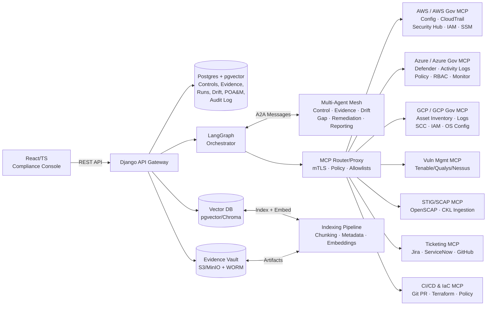

# Platform Architecture — Multi-Cloud AI Continuous ATO

## Overview

This platform provides continuous, AI-driven Authority to Operate (ATO) compliance monitoring across multi-cloud environments (AWS, Azure, GCP — including Government partitions). It uses **Agentic RAG**, **MCP** (Model Context Protocol), **A2A** (Agent-to-Agent), and **LangGraph** orchestration.

## Architecture Diagram

## Key Components

| Component | Technology | Purpose |
|-----------|-----------|---------|
| **API Gateway** | Django REST Framework | REST API, auth, serialization, OpenAPI docs |
| **Database** | PostgreSQL + pgvector | Controls, evidence metadata, runs, POA&M, audit log, vector embeddings |
| **Evidence Vault** | MinIO (S3-compatible) | Immutable evidence storage with SHA-256 hashing and WORM retention |
| **Vector Store** | pgvector / Chroma | Embeddings for RAG retrieval (controls, STIGs, SSP, policies) |
| **Orchestrator** | LangGraph | State graph with conditional edges, approval gates, retry logic |
| **Agent Mesh** | LangGraph nodes + A2A | 9 specialized agents communicating via structured messages |
| **MCP Router** | Custom Python | Policy enforcement, rate limiting, audit logging for all tool calls |
| **Task Queue** | Celery + Redis | Async compliance run execution |
| **Frontend** | React + TypeScript | Dashboard, control cockpit, evidence explorer, approvals |

## ATO-Grade Guarantees

1. **Immutable Audit Trail** — Every MCP tool call logged with input, output hash, timestamp, agent ID
2. **Evidence Integrity** — SHA-256 hashing on all artifacts; WORM-compatible storage
3. **Human Approval Gates** — High-severity remediation actions require human review
4. **Cross-Framework Mapping** — NIST 800-53 ↔ FedRAMP ↔ RMF ↔ STIG (via CCI)
5. **Multi-Cloud Parity** — Single canonical interface across AWS/Azure/GCP (commercial + gov)
6. **Evidence Freshness SLAs** — Time-aware retrieval ensures evidence is within compliance windows
